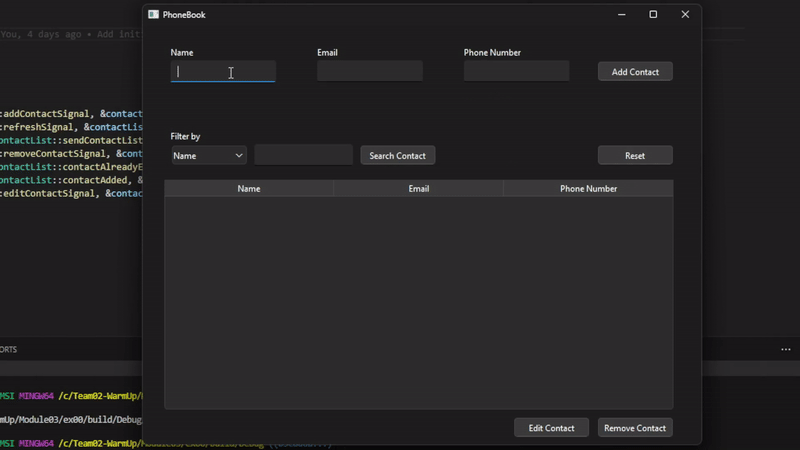
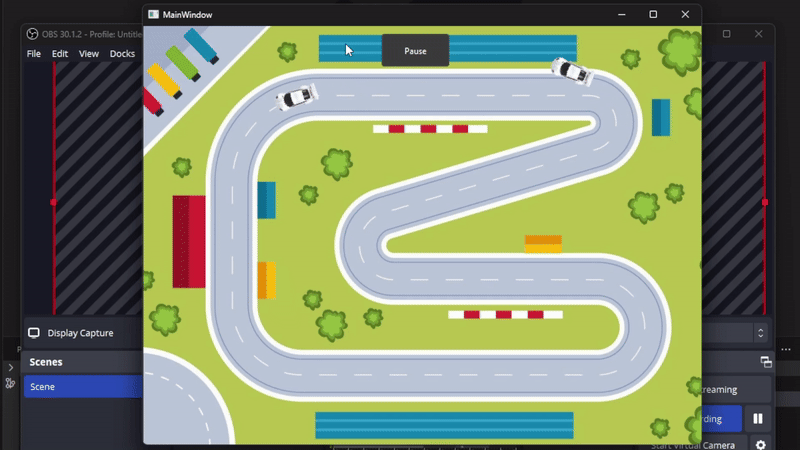

# **SEA:ME WarmUp**  
#### *SEA:ME Software Engineering in Automotive and Mobility Ecosystems*

Welcome to the **SEA:ME WarmUp**, where our team explores the fundamentals of software engineering for automotive and mobility ecosystems. Through structured modules, we've built skills in **C++**, **Qt**, and **multi-threading**, culminating in exciting projects.

---

## 📚 **Project Overview**

This project consists of five modules, each designed to develop and enhance specific programming concepts.

---

## 🔍 **Modules Breakdown**

### 🟢 **Module 00: Getting Started**
- **Welcome to SEA:ME**:  
  Set up our development environment, created GitHub repositories, and learned repository management best practices.  
- **Exploring Qt**:  
  Installed and configured the **Qt Framework** to prepare for GUI and advanced applications.  
- **String Manipulation**:  
  Practiced C++ string operations such as `substr`, `append`, and `replace`.  
- **Old Phonebook**:  
  Created a CLI-based phonebook application featuring `ADD`, `SEARCH`, `REMOVE`, and `BOOKMARK`.

---

### 🟢 **Module 01: Object-Oriented Programming**  
- **Orthodox Canonical Form**: Implemented classes with constructors, destructors, and operator overloads.  
- **Sports Car Inheritance**: Enhanced the `Car` class using OOP principles like inheritance and polymorphism.  
- **Software-Defined Car**: Modeled a detailed car using abstraction, encapsulation, and modular design.

---

### 🟢 **Module 02: Smart Memory Management**  
- Used **smart pointers** to avoid memory leaks and dangling pointers.  
- Modeled a car with detailed parts such as **engine**, **wheels**, and **brakes**, showcasing composite object design.

---

### 🟢 **Module 03: Qt Graphical Applications**  
We developed a **Graphical Phonebook** application using the Qt framework.  

**Features:**  
- A user-friendly GUI for managing contacts.  
- Persistent data storage for contact information.  
- A search functionality with filters by name or phone number.  
- Seamless integration of **signals and slots** for real-time updates.  

💡 **Highlight:** Qt Designer streamlined GUI development, and working with widgets brought the application to life.

---

  
*Example of the Graphical Phonebook interface in action.*

---

### 🟢 **Module 04: Multi-Threaded Racing Game**  

We created a **multi-threaded racing game** to simulate the dynamics of cars on a race track.

**Features:**  
- **Car Class**: Modeled cars with position, speed, and direction attributes.  
- **RaceTrack Class**: Simulated the race environment, including track size and finish line.  
- **Multi-threading**: Used **QThread** to simulate independent car movements.  
- **Synchronization**: Ensured fairness in the race using thread-safe mechanisms.  
- **Interactive GUI**: The game interface allows users to start, pause, or reset the race.  

💡 **Highlight:** Combining multi-threading with GUI elements resulted in an interactive and engaging experience.

---

 
*Example of the Racing Game showcasing real-time car movements.*

---

## 👨‍💻 **About the Team**

We are a group of students from **SEA:ME (Software Engineering in Automotive and Mobility Ecosystems)**, passionate about building solutions for the future of mobility. Our focus lies in mastering advanced software concepts to tackle real-world challenges in the automotive industry.

<table>
  <tr>
    <td align="center">
      <a href="https://github.com/Rui-Pedro-Pires">
        
         
        <b>Rui Pedro Pires</b>
      </a>
    </td>
    <td align="center">
      <a href="https://github.com/ziliolu">
        
         
        <b>Luiza Zilio</b>
      </a>
    </td>
    <td align="center">
      <a href="https://github.com/luis-ffe">
        
         
        <b>Luis Felipe Carvalho</b>
      </a>
    </td>
    <td align="center">
      <a href="https://github.com/mjorgecruz">
        
         
        <b>Jorge Cruz</b>
      </a>
    </td>
  </tr>
</table>
---

## 💻 **Repository Information**

- **Technologies**:  
  - Programming Language: **C++**  
  - Framework: **Qt**  
  - Tools: **GitHub**, **Qt Designer**  
- **Modules**: 00, 01, 02, 03, 04  

---

### 📩 **Feedback & Contributions**

We welcome feedback and collaboration! Feel free to open issues or pull requests on our repository.

---
